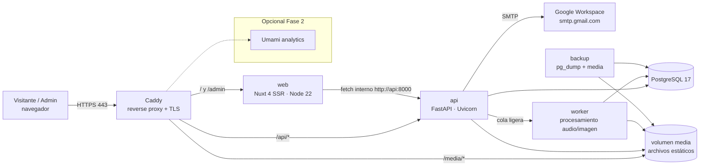

# 02 · Arquitectura y decisiones técnicas

> **Cómo** se construye lo especificado en `01-especificacion.md`.

## 1. Vista general



- **Monorepo** con `frontend/` (Nuxt) y `backend/` (FastAPI), `infra/` (Caddy, compose, scripts).
- **Un solo frontend** sirve el sitio público (SSR, SEO) y el admin (`/admin/**` renderizado en cliente).
- **Un solo backend** expone la API REST pública (lectura) y la API de admin (autenticada).
- El **worker** es el mismo código del backend corriendo otro comando (procesa audio e imágenes fuera del request).

## 2. Stack y justificación (ADR resumido)

| Capa | Elección | Por qué | Alternativa descartada |
|------|----------|---------|------------------------|
| Frontend | **Nuxt 4 (Vue 3.5, TypeScript)** | Es Vue, pero con SSR/SSG: indispensable para SEO y para que los links compartidos en Instagram/WhatsApp muestren vista previa (OG). Routing, `useFetch`, `useSeoMeta`, image module listos. | Vue SPA con Vite: sin SSR, las vistas previas en redes y el SEO sufren. |
| Estilos | **CSS custom properties (tokens del template) + Tailwind CSS v4** con `@theme` mapeado a los tokens | Se conserva la paleta exacta; Tailwind acelera el trabajo del agente y mantiene consistencia. | Reescribir en otro design system: rompe la marca. |
| UI admin | **Nuxt UI** (tablas, formularios, modales) con tema Cherry | Productividad en CRUD; accesible; mismo ecosistema. | Construir admin a mano: lento. |
| Estado | **Pinia** (reproductor global, sesión admin) | Estándar Vue. | — |
| Audio | **wavesurfer.js v7** + Web Audio API para A/B | Waveform con peaks precalculados (no decodifica en cliente); Web Audio permite cambiar A/B sin cortar. | `<audio>` simple: no permite A/B sincronizado. |
| Animación | CSS + IntersectionObserver (como el template); **GSAP** solo si se requiere ScrollTrigger | Ligero; respeta reduced‑motion. | Librerías pesadas de animación. |
| Backend | **FastAPI + Pydantic v2 + SQLAlchemy 2 (async) + Alembic** sobre Python 3.12 | Pedido del equipo; tipado fuerte, OpenAPI automático para generar el cliente TS. | Django: más pesado para este alcance. |
| Gestión deps Python | **uv** | Rápido, lockfile reproducible. | pip-tools. |
| BD | **PostgreSQL 17** | Robusta, JSONB para settings, full‑text para búsqueda en admin. | SQLite: limita concurrencia y respaldos en caliente. |
| Cola | **Tabla `jobs` en Postgres + worker con `SELECT … FOR UPDATE SKIP LOCKED`** | Cero infraestructura extra para volumen bajo. | Redis + Celery/RQ: más piezas que operar (se puede migrar después). |
| Procesamiento medios | **ffmpeg** (transcodificar, LUFS con `ebur128`), **audiowaveform** o numpy para peaks, **Pillow** para imágenes WebP/AVIF | Estándar, corre en el contenedor. | Servicios externos de pago. |
| Almacenamiento | **Volumen Docker `media`** servido por Caddy en `/media` | Simple; respaldable con tar/restic. Interfaz `StorageBackend` para cambiar a S3/R2 sin tocar lógica. | S3 desde día 1: costo/complejidad innecesarios. |
| Correo | **SMTP de Google Workspace** (`smtp.gmail.com:587`) vía `aiosmtplib` | El dominio ya está en Workspace. En local, Mailpit. | Netlify Forms: lo dejamos al salir de Netlify. |
| Anti‑spam | Honeypot + `slowapi` rate limit + **Cloudflare Turnstile** opcional | Sin fricción para usuarios reales. | reCAPTCHA: cookies de Google, peor UX. |
| Proxy/TLS | **Caddy 2** | HTTPS automático (Let’s Encrypt), config mínima, sirve `/media`. | Nginx + certbot: más pasos. |
| Analítica (F2) | **Umami** autoalojado | Sin cookies, respeta privacidad, mismo Postgres. | Google Analytics: requiere banner de cookies. |
| CI/CD | **GitHub Actions → GHCR → servidor** (`docker compose pull && up -d`) | Imágenes versionadas, rollback trivial. | Build en el servidor (se permite como plan B). |

## 3. Estructura del repositorio

```
pagina_ram/
├── AGENTS.md                    # Instrucciones para agentes (Cursor/Claude)
├── README.md
├── .cursor/rules/               # Reglas de Cursor que apuntan a docs/
├── docs/
│   ├── sdd/                     # Esta especificación
│   ├── skills/                  # Skills para el agente
│   └── prompts/                 # Prompts listos para Cursor
├── cherry-studios-site/         # Template aprobado (REFERENCIA, no se despliega)
├── frontend/                    # Nuxt 4
│   ├── app/
│   │   ├── assets/css/          # tokens.css, base.css, tailwind.css
│   │   ├── components/
│   │   │   ├── site/            # Hero, ServiceCard, EmbedFacade, ABPlayer, …
│   │   │   ├── player/          # GlobalPlayer, Waveform
│   │   │   └── admin/           # componentes solo del admin
│   │   ├── composables/         # useApi, usePlayer, useUtm, useReveal, …
│   │   ├── layouts/             # default.vue, admin.vue, links.vue
│   │   ├── pages/               # index, servicios/[slug], portafolio/…, links, admin/**
│   │   ├── stores/              # player.ts, auth.ts
│   │   └── types/api.ts         # GENERADO desde OpenAPI (no editar a mano)
│   ├── server/                  # rutas Nitro: og-image, proxy de preview
│   ├── public/                  # favicons, robots fallback
│   ├── nuxt.config.ts
│   └── Dockerfile
├── backend/
│   ├── app/
│   │   ├── main.py
│   │   ├── core/                # config, security, db, storage, email, logging
│   │   ├── models/              # SQLAlchemy
│   │   ├── schemas/             # Pydantic
│   │   ├── repositories/
│   │   ├── services/            # lógica de negocio
│   │   ├── routers/
│   │   │   ├── public/          # /api/v1/public/*
│   │   │   └── admin/           # /api/v1/admin/*
│   │   ├── workers/             # jobs: audio, imagen, email
│   │   └── seed/                # datos iniciales del template
│   ├── alembic/
│   ├── tests/
│   ├── pyproject.toml
│   └── Dockerfile
└── infra/
    ├── docker-compose.yml       # base
    ├── docker-compose.dev.yml   # overrides dev (hot reload, puertos)
    ├── docker-compose.prod.yml  # overrides prod (imágenes GHCR, límites)
    ├── Caddyfile
    ├── .env.example
    └── scripts/                 # backup.sh, restore.sh, deploy.sh
```

## 4. Flujo de datos y caché

- **Páginas públicas:** Nuxt SSR pide a la API interna (`http://api:8000`) con `useFetch`. `routeRules` con **SWR de 60 s** para `/`, `/servicios/**`, `/portafolio/**`, `/links`. Cambios del admin aparecen en ≤ 60 s.
- **Revalidación inmediata:** al guardar en admin, el backend llama `POST http://web:3000/api/_revalidate` (token interno) para purgar la caché de Nitro de las rutas afectadas.
- **API pública:** respuestas con `Cache-Control: public, max-age=60, stale-while-revalidate=300` y `ETag`.
- **Medios:** nombres con hash de contenido → `Cache-Control: public, max-age=31536000, immutable` desde Caddy.
- **Admin:** sin caché; `ssr: false` en `/admin/**`.

## 5. Pipeline de medios

1. Admin sube archivo → `POST /api/v1/admin/media` (multipart, streaming a disco, validación de tipo por *magic bytes*, tamaño máx.).
2. Se crea `MediaAsset(status=processing)` y un `Job`.
3. Worker:
   - **Imagen:** genera `webp` y `avif` en 480/960/1600 px + `blurhash`/LQIP; guarda dimensiones.
   - **Audio:** transcodifica a `m4a (AAC 256k)` y `mp3 320k`, calcula **LUFS integrado** (`ffmpeg -af ebur128`), genera **peaks JSON** (800 puntos) para wavesurfer, duración.
4. `MediaAsset(status=ready)`; el admin ve el resultado por polling.

## 6. Reproductor global y A/B (frontend)

- `stores/player.ts` (Pinia) mantiene: cola, pista actual, estado, posición. El componente `<GlobalPlayer>` vive en `layouts/default.vue` → **persiste entre rutas**.
- Evento único `player:exclusive` para pausar Spotify/YouTube/otros cuando empieza cualquier fuente (generaliza `__pauseAllExcept` del template).
- `<ABPlayer>`: dos `AudioBufferSourceNode`/`MediaElementSource` conectados a dos `GainNode`; el switch hace cross‑fade de 30 ms. Compensación de ganancia = `10^((LUFS_objetivo - LUFS_pista)/20)`.
- Embeds externos con **fachada** (`<EmbedFacade>`): portada + botón; el `iframe` se inyecta solo al clic.

## 7. Seguridad

- Auth: JWT de acceso (15 min) + refresh (7 días) en cookies `httpOnly; Secure; SameSite=Lax`; rotación de refresh; CSRF con doble cookie en métodos mutantes del admin.
- Contraseñas con **Argon2id** (`pwdlib`).
- CORS: solo el dominio propio (en prod el front y API comparten dominio vía Caddy → CORS casi innecesario).
- Rate limits: `POST /public/leads` 5/min y 30/día por IP; login 10/min.
- Validación de archivos por *magic bytes*; nombres aleatorios; nunca servir uploads de leads públicamente (van a `/media/private`, descargables solo vía endpoint autenticado).
- Cabeceras de seguridad en Caddy: HSTS, CSP (permitiendo `open.spotify.com`, `www.youtube-nocookie.com`, `w.soundcloud.com`, `challenges.cloudflare.com`), `X-Content-Type-Options`, `Referrer-Policy`.
- Logs sin datos personales en claro.

## 8. Presupuestos de rendimiento

| Métrica | Presupuesto |
|---------|-------------|
| JS inicial (público) | ≤ 170 KB gzip |
| CSS inicial | ≤ 40 KB gzip |
| Imagen hero | ≤ 180 KB (AVIF/WebP, `fetchpriority=high`, `preload`) |
| Fuentes | Fraunces + Work Sans **autoalojadas**, subset latino, `font-display: swap`, máx. 4 archivos |
| Lighthouse móvil | ≥ 90 / 95 / 95 / 95 |

## 9. Observabilidad

- Logs JSON estructurados (backend) a stdout → `docker logs`; rotación configurada en compose.
- `/api/health` (liveness) y `/api/ready` (BD accesible) para healthchecks.
- Errores: Sentry opcional (DSN por env, desactivado por defecto; GlitchTip autoalojado como alternativa).
