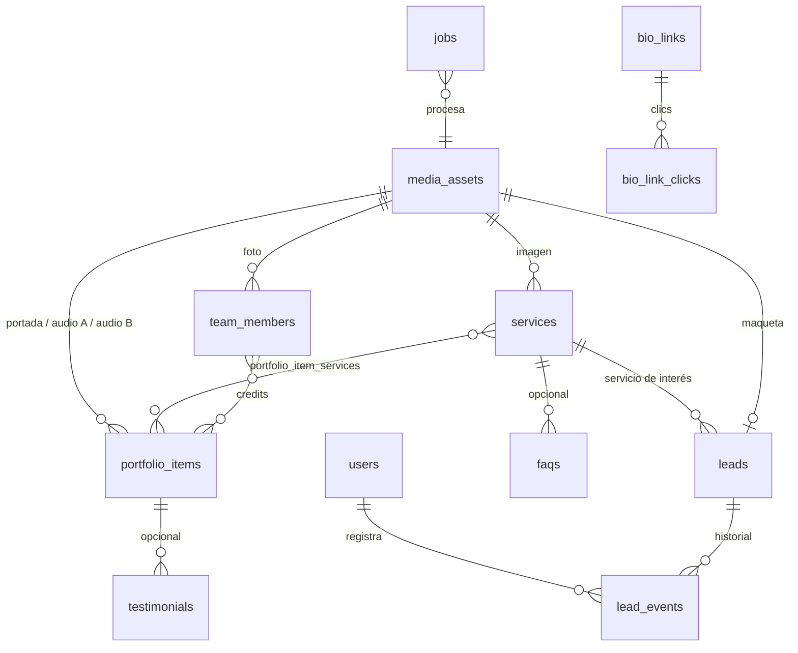

# 03 · Modelo de datos

> PostgreSQL 17 · SQLAlchemy 2 · migraciones con Alembic.
> Convenciones: tablas en plural `snake_case`; PK `id` UUIDv7 (ordenable); `created_at`, `updated_at` (`timestamptz`) en todas; borrado lógico con `deleted_at` en entidades de contenido; `sort_order int` donde hay orden manual; `is_published bool` para borrador/publicado.

## Diagrama



## Entidades (Fase 1)

### `users`
| campo | tipo | notas |
|-------|------|-------|
| email | citext unique | |
| full_name | text | |
| password_hash | text | Argon2id |
| role | enum(`admin`,`superadmin`) | |
| is_active | bool | |
| failed_logins | int | bloqueo temporal |
| locked_until | timestamptz null | |
| last_login_at | timestamptz null | |

Tablas de sesión (no son contenido): `refresh_tokens` (hash, vence a 7 días, se revoca), `password_reset_tokens` (hash, 1 hora, un solo uso) y `preview_tokens` (hash, 2 horas, para ver borradores).

### `site_settings` (fila única, `id = 1`)
| campo | tipo | notas |
|-------|------|-------|
| data | jsonb | validado por esquema Pydantic `SiteSettingsSchema` (ver abajo) |
| updated_by | fk users | |

`SiteSettingsSchema` (claves principales):
```
brand:    { name, tagline, logo_media_id, logo_alt_media_id }
hero:     { quote, title_html, cta_primary_text, cta_secondary_text, image_media_id }
studio:   { eyebrow, title, body, image_media_id, image_caption }
team:     { eyebrow, title }
services: { eyebrow, title, lede, hint }
portfolio:{ eyebrow, title, note, featured_limit }
contact:  { eyebrow, title, email, whatsapp_e164, whatsapp_default_msg,
            notify_emails[], consent_text }
social:   { instagram, tiktok, youtube, spotify, facebook, x, threads, soundcloud }
seo:      { default_title, title_template, default_description, og_image_media_id }
legal:    { privacy_html, privacy_updated_at }
features: { ab_player, testimonials, turnstile, whatsapp_float }
```

### `media_assets`
| campo | tipo | notas |
|-------|------|-------|
| kind | enum(`image`,`audio`,`file`) | |
| visibility | enum(`public`,`private`) | maquetas de leads = private |
| original_filename | text | |
| mime_type | text | detectado por magic bytes |
| size_bytes | bigint | |
| storage_key | text | ruta relativa en volumen |
| status | enum(`uploaded`,`processing`,`ready`,`failed`) | |
| variants | jsonb | `{webp:{480:key,…}, avif:{…}, m4a:key, mp3:key}` |
| width, height | int null | imagen |
| duration_s | numeric null | audio |
| lufs_integrated | numeric null | audio |
| peaks_key | text null | JSON de waveform |
| lqip | text null | placeholder base64 |
| alt_text | text null | obligatorio para imágenes públicas |
| sha256 | text | deduplicación |

### `services`
| campo | tipo | notas |
|-------|------|-------|
| slug | text unique | |
| number_label | text | “01” (autogenerado por orden si vacío) |
| title | text | |
| short_description | text | reverso de tarjeta, ≤ 180 car. |
| long_description | text (markdown) | página del servicio |
| icon | text | nombre de ícono del set Cherry (SVGs del template) |
| price_from_mxn | int null | “Desde $X” |
| image_media_id | fk null | |
| seo_title, seo_description | text null | |
| sort_order, is_published, deleted_at | | |

### `team_members`
slug, full_name, nickname, role_label, bio_short, bio_long (md), photo_media_id, socials (jsonb), sort_order, is_published.

### `portfolio_items`
| campo | tipo | notas |
|-------|------|-------|
| slug | text unique | |
| title | text | |
| artist_name | text | |
| year | int null | |
| genre | text null | |
| kind | enum(`own_audio`,`spotify`,`youtube`,`soundcloud`,`apple_music`,`bandcamp`) | |
| external_url | text null | URL original pegada por admin |
| external_id | text null | extraído automáticamente (ej. id de track) |
| youtube_start_s | int null | ej. 137 |
| cover_media_id | fk null | si falta y es externo, se intenta oEmbed |
| audio_after_media_id | fk null | pista principal (“Después”) |
| audio_before_media_id | fk null | si existe → habilita A/B |
| credits_text | text | “Mezcla y máster por Chemita” |
| description | text (md) null | |
| is_featured | bool | aparece en inicio |
| is_ab_featured | bool | aparece en “Escucha la diferencia” |
| play_count | int | incrementado por evento público |
| sort_order, is_published, deleted_at | | |

Tablas puente: `portfolio_item_services(portfolio_item_id, service_id)`, `portfolio_item_credits(portfolio_item_id, team_member_id, role_label)`.

### `testimonials`
quote, author_name, author_role (ej. “Cantautor”), project_label, photo_media_id null, portfolio_item_id null, sort_order, is_published.

### `faqs`
question, answer (md), service_id null (null = global), sort_order, is_published.

### `bio_links`
label, url, icon, is_internal (bool, agrega UTM), utm_overrides (jsonb), starts_at null, ends_at null, highlight (bool), sort_order, is_published.

### `bio_link_clicks`
bio_link_id, clicked_at, referrer, user_agent_family, country (de cabecera si existe). **Sin IP almacenada.**

### `leads`
| campo | tipo | notas |
|-------|------|-------|
| name | text | |
| email | citext null | al menos uno de email/phone |
| phone_e164 | text null | |
| service_id | fk null | null = “Aún no estoy seguro” |
| message | text | |
| demo_url | text null | |
| demo_media_id | fk null | private |
| tentative_date | date null | |
| consent_at | timestamptz | obligatorio |
| consent_text_version | text | hash/fecha del aviso vigente |
| status | enum(`new`,`contacted`,`quoted`,`won`,`lost`) | |
| source_page | text | |
| referrer | text null | |
| utm_source, utm_medium, utm_campaign, utm_content, utm_term | text null | |
| quote_payload | jsonb null | Fase 2 (cotizador) |
| ip_hash | text | sha256(ip + salt) para rate‑limit/abuso, no la IP |
| deleted_at | | cancelación ARCO → borrado físico real vía acción explícita |

### `lead_events`
lead_id, user_id null, type (`status_change`,`note`,`email_sent`), from_status, to_status, note, created_at.

### `play_events` (agregado ligero)
portfolio_item_id, event (`play`,`ab_toggle`,`complete`), occurred_on (date), count — upsert diario (sin datos personales).

### `jobs`
type (`process_image`,`process_audio`,`send_email`,`revalidate`), payload jsonb, status (`queued`,`running`,`done`,`failed`), attempts, run_after, last_error.

## Entidades previstas (Fase 2–3, no crear aún)

`availability_blocks`, `session_requests`, `quote_rules`, `case_studies`, `posts`, `client_projects`, `review_versions`, `review_comments (timestamp_s, body, author)`, `payments`, `subscribers`.
Se listan para que las decisiones de Fase 1 no las bloqueen.

## Seed inicial

`backend/app/seed/` carga desde el template:
- 8 servicios (tabla de `01-especificacion.md`), íconos SVG del template.
- 2 integrantes con fotos `founder-1.jpg`, `founder-2.jpg`.
- 3 piezas de portafolio (Palenque, Esta Noche, Neto) incluyendo el MP3.
- `site_settings` con todos los textos actuales del template y el aviso de privacidad actual.
- Usuario superadmin desde env `SEED_ADMIN_EMAIL` / `SEED_ADMIN_PASSWORD`.
- Enlaces `/links`: Contacto, WhatsApp, Instagram, Spotify, Portafolio.
Comando: `docker compose exec api python -m app.seed` (idempotente).
